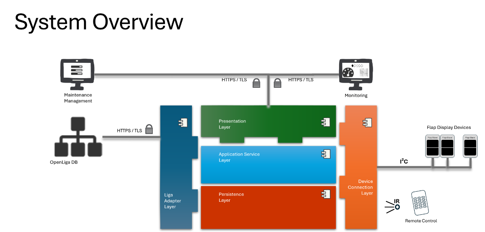

# The ultimativ Flap Display I²C Master

## Overview
The picture shows a layered architecture for a split-flap display system. End-user and admin UIs talk securely to a central service stack, which in turn persists data, integrates external systems, and drives the physical flap devices via a device/bus layer.

## Clients over HTTPS/TLS

Operator UI and Admin/Monitoring UI connect to the backend using HTTPS/TLS.

The T-junction suggests a gateway or shared API endpoint that fans into the backend.

## Core service stack (middle, green/blue/red)

* Presentation Layer: 
Web/API endpoints, request handling, view models.

* Application Service Layer: 
Orchestrates use-cases and business logic; coordinates between presentation, persistence, adapters, and devices.

* Persistence Layer: Data storage access (DB/EEPROM/files), repositories, transactions.

* Liga Adapter Layer: 
An adapter layer for an external system. Communication is secured, and adapters translate external models into the internal domain model.

* Device Connection Layer: 
Hardware/I²C-bus abstraction that the application uses to control physical modules.

On the far right, multiple “Flap Slave” devices are chained on a local bus (e.g., I²C). This layer hides bus details and exposes device-level operations.