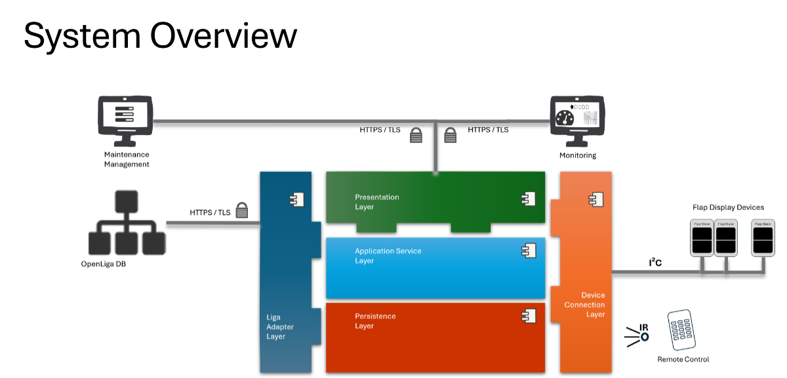

# The ultimativ Flap Display I²C Master

## Overview
The picture shows a layered architecture for a split-flap display system. End-user and admin UIs talk securely to a central service stack, which in turn persists data, integrates external systems, and drives the physical flap devices via a device/bus layer.

## Clients over HTTPS/TLS

Operator UI and Admin/Monitoring UI connect to the backend using HTTPS/TLS.

The T-junction suggests a gateway or shared API endpoint that fans into the backend.

## Core service stack

### Presentation Layer: 
Web/API endpoints, request handling, view models.

### Application Service Layer: 
Orchestrates use-cases and business logic; coordinates between presentation, persistence, adapters, and devices.

### Persistence Layer: 
Data storage access (EEPROM) for secure parameter management.

## Liga Adapter Layer: 
An adapter layer to connect external systems. Communication is secured, and adapters translate external models into the internal domain model of zhe flap display system.

## Device Connection Layer: 
Hardware/I²C-bus abstraction that the application uses to control physical modules.

## Peripherie

On the far right, multiple “Flap Slave” devices are chained on a local bus (e.g., I²C). This layer hides bus details and exposes device-level operations.

Under this there is shown an IR Remote Control. With the help of it some maintenance features like calibration or speed measurement  can be controled.

On the left, as example for external systems there is shown the the free OpenLiga DB. This is connected over an adapter to enable the flap display system to show live liga tables.